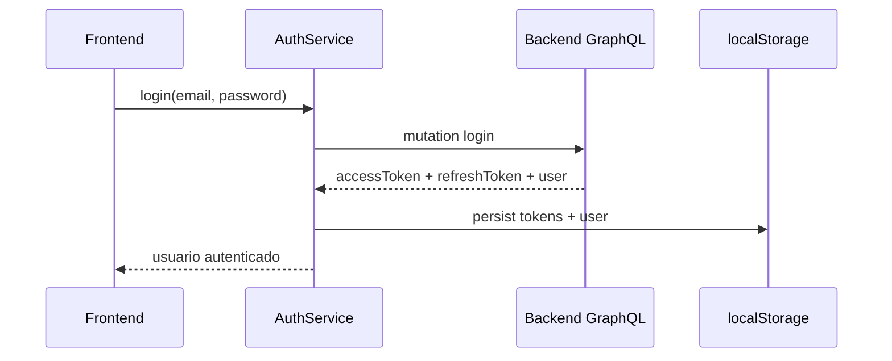
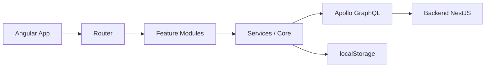
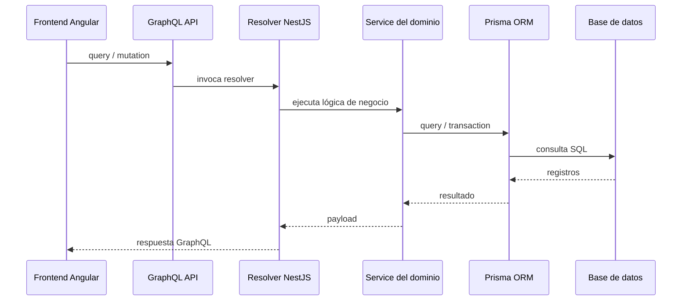

# Arquitectura del Frontend (Angular + SSR + GraphQL)

## 1. Visión general

El frontend de Kooality está construido con Angular 21 y usa una arquitectura modular orientada a dominios y rutas lazy-load. La aplicación combina:

- Angular Router para navegación y guardas de acceso
- Angular SSR para renderizado del lado del servidor
- Apollo Angular para consumo de GraphQL
- RxJS para manejo reactivo de autenticación y datos
- Material Angular para componentes de UI
- Firebase para soporte de autenticación / servicios auxiliares

La estructura principal está en `src/app`, donde se dividen responsabilidades por capa y dominio.

## 2. Estructura de carpetas

```text
src/
  app/
    app.config.ts
    app.routes.ts
    app.ts
    app.html
    app.scss
    core/
      services/
      models/
    features/
      admin/
      auth/
      cart/
      home/
      kids/
      men/
      products/
      profile/
      ...
    layout/
      admin/
      navbar/
      footer/
      shell/
    shared/
      alert/
      confirm-dialog/
      parameter-products/
```

## 3. Capas principales

### 3.1 Core
La carpeta `core` concentra servicios y modelos transversales:

- `auth.service.ts`: autenticación, login, refresh token, persistencia en localStorage, validación de sesión
- `language.service.ts`, `language-context.service.ts`: internacionalización / contexto de lenguaje
- `country-context.service.ts`: contexto del país vigente
- `navigation.service.ts`: navegación de la app
- `favorites.service.ts`: favoritos del usuario

Estos servicios normalmente funcionan como capas de acceso y estado global compartido.

### 3.2 Features
La carpeta `features` refleja funcionalidades de negocio por dominio, por ejemplo:

- `auth`
- `admin`
- `products`
- `cart`
- `profile`
- `favorites`
- `home`
- `legal`
- `contact`
- `returns`
- `sitemap`

Cada feature encapsula su propio flujo, componentes y lógica asociada.

### 3.3 Layout
La carpeta `layout` define la estructura general de la UI:

- shell principal
- navbar
- footer
- admin shell

Esto separa la composición visual de las features y ayuda a reutilizar la infraestructura de la app.

### 3.4 Shared
La carpeta `shared` contiene componentes reutilizables y utilidades de UI:

- dialogs
- alerts
- parameter entities
- componentes compartidos en varias features

## 4. Rutas y lazy loading

El sistema de rutas está centralizado en `src/app/app.routes.ts`.

Observaciones clave:

- Se usa `loadComponent` para cargar módulos o vistas bajo demanda.
- Hay rutas protegidas mediante `canMatch` con guardas de autenticación.
- El módulo de admin usa una estructura jerárquica de rutas.
- Hay redirecciones por rol y estado de sesión.

Ejemplo de patrón:

```ts
{
  path: 'admin',
  canMatch: [requireAuth],
  loadComponent: () => import('./layout/admin/admin-shell').then((m) => m.AdminShellComponent),
  children: [
    { path: '', redirectTo: 'dashboard' },
    { path: 'dashboard', loadComponent: () => import('./features/admin/dashboard/dashboard') }
  ]
}
```

Esto mejora:

- carga inicial más rápida
- separación por feature
- mantenibilidad

## 5. Autenticación y sesión

La autenticación se maneja principalmente en `core/services/auth.service.ts`.

Patrón actual:

- el usuario y tokens se guardan en `localStorage`
- se usa `BehaviorSubject<User | null>` para exponer el estado del usuario
- se implementan login y refresh token
- el servicio intercepta respuestas GraphQL con errores de autenticación
- si el token expira, hace refresh automático usando el refresh token

### Flujo de autenticación



## 6. Comunicación con el backend

La comunicación se hace con Apollo Angular sobre GraphQL.

Archivo principal:

- `src/app/app.config.ts`

Configuración clave:

- `APOLLO_OPTIONS`
- `HttpLink` apuntando al endpoint GraphQL
- `authLink` agrega el header `Authorization: Bearer ...`
- `errorLink` intercepta errores de autenticación y dispara refresh token

Esto centraliza la lógica de acceso al servidor y evita duplicación en cada componente.

## 7. Estado y flujo de datos

La app usa un modelo híbrido:

- estado local del componente con `signals` y propiedades internas
- servicio compartido para estado global de sesión
- `RxJS` para streams reactivos
- Apollo cache para consultas GraphQL

No hay un store global fuerte como NgRx/Redux en este repo. La tendencia es modularizar el estado en servicios por dominio.

## 8. Arquitectura visual



## 9. Principios de diseño detectados

1. Separación por feature
2. Lazy loading en rutas
3. Centralización de seguridad en `AuthService`
4. Consume GraphQL desde servicios, no desde componentes
5. Uso de `core` para conceptos transversales
6. SSR habilitado para rendimiento y renderizado inicial

## 10. Buenas prácticas y riesgos actuales

### Fortalezas

- organización clara por dominio
- rutas protegidas por guardas
- consumo centralizado de GraphQL
- separación entre UI y lógica de sesión

### Oportunidades de mejora

- consolidar mejor un patrón de state management para módulos más complejos
- estandarizar nombres de servicios y componentes por feature
- reducir lógica de negocio en componentes y moverla a servicios/domain helpers
- documentar más explícitamente contratos GraphQL por módulo

## 11. Resumen

La arquitectura del frontend está enfocada en una app Angular modular, SSR, con backend GraphQL y servicios de dominio bien separados. La base es sólida para escalar, siempre que se mantenga la disciplina de centralizar acceso a datos, seguridad y estado compartido en capas bien definidas.

## 12. Arquitectura del backend en /koality-backend/src

El backend de Kooality está implementado con NestJS y TypeScript, y su entrada principal está en `src/app.module.ts`. La arquitectura del código fuente en `src` está organizada por módulos funcionales, no por capas transversales centralizadas de forma única.

### 12.1 Estructura principal

```text
src/
  app.module.ts
  main.ts
  schema.gql
  modules/
    admin/
    auth/
    business-rules/
    catalogs/
    common/
    menuuser/
    mlm/
    orders/
    pages/
    parameterproducts/
    pricing/
    products/
    purchase-adjustments/
    reports/
    storage/
    storefront/
    upload/
    user-locations/
    users/
```

### 12.2 Módulo raíz y composición

`AppModule` centraliza la infraestructura de la aplicación:

- `ConfigModule.forRoot({ isGlobal: true })`
- `JwtModule.registerAsync(...)`
- `GraphQLModule.forRoot(...)`
- registro de módulos funcionales como `CatalogsModule`, `ProductsModule`, `OrdersModule`, `UsersModule`, `ReportsModule`, `UploadModule`, etc.
- integración de `PrismaModule`

El módulo raíz combina la capa de seguridad, la exposición GraphQL y la composición de dominios del negocio.

### 12.3 Configuración GraphQL

En `src/app.module.ts` se usa `ApolloDriver` con:

- `autoSchemaFile: join(process.cwd(), 'src/schema.gql')`
- `playground: true`
- `introspection: true`
- `context: ({ req, res }) => ({ req, res })`

Esto indica que la API principal del backend no es REST, sino GraphQL, con un esquema generado de forma automática a partir de resolvers y decoradores.

### 12.4 Patrón por módulo

El backend sigue una convención clara de NestJS:

```ts
@Module({
  imports: [PricingModule],
  providers: [ProductsService, ProductsResolver],
  exports: [ProductsService],
})
export class ProductsModule {}
```

Este patrón es visible en módulos clave como `products` y `auth`, donde cada dominio tiene:

- `module.ts` para registro
- `resolver.ts` para exposición GraphQL
- `service.ts` para lógica de negocio
- `dto` / `input` / tipos para contratos de entrada y salida

### 12.5 Autenticación y seguridad

La seguridad está basada en JWT y Passport, con `AuthModule` configurado así:

- `PassportModule`
- `JwtModule`
- `AuthService`
- `AuthResolver`
- `JwtStrategy`

Esto habilita el flujo de login, generación de tokens y validación de sesión para todos los módulos que lo requieran.

### 12.6 Prisma y persistencia

El backend usa Prisma como capa de acceso a datos. La integración se hace a través de `PrismaModule`, y el restante del sistema consume la base de datos desde servicios de dominio. Esto permite desacoplar la lógica de negocio de la consulta SQL directa y mantener un acceso más controlado a la base de datos.

### 12.7 Dominios funcionales detectados

La estructura de `src/modules` refleja una aplicación de negocio con varios dominios:

- `auth`: autenticación, login y tokens
- `users`: usuarios y perfiles
- `products`: catálogo de productos
- `catalogs`: tablas maestras y parámetros
- `parameterproducts`: entidades parametrizadas
- `pricing`: pricing y reglas de costo
- `orders`: pedidos y compras
- `reports`: consultas analíticas y reportes
- `upload`: archivos y carga de contenido
- `storefront`: comercio y experiencia del storefront
- `mlm`: negocio de red / multinivel
- `purchase-adjustments`: ajustes de compra
- `user-locations`: ubicaciones del usuario
- `admin`: administración de configuración y reglas internas

### 12.8 Flujo de consulta



### 12.9 Conclusión de backend

La arquitectura del backend en `koality-backend/src` está basada en:

1. NestJS modular por dominio
2. GraphQL como capa de exposición principal
3. Prisma como capa de persistencia
4. JWT para autenticación y seguridad
5. servicios especializados para cada negocio

Esto es una base sólida para un sistema de comercio con administración, pricing, catálogo, usuarios, ubicación, reportes y operaciones del negocio.

---

En conjunto, el sistema completo tiene una arquitectura consistente: frontend Angular modular con routes lazy-load y backend NestJS modular con GraphQL + Prisma. Ambas capas están diseñadas para escalar por dominio y para mantener la lógica de negocio separada tanto de la interfaz como de la persistencia.
